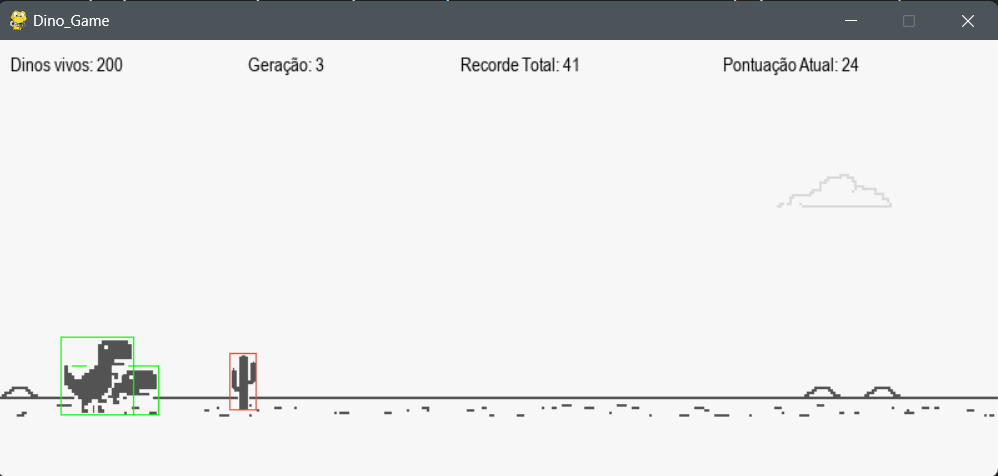
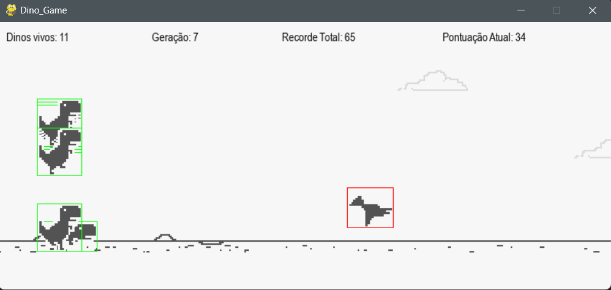
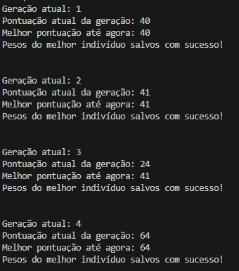
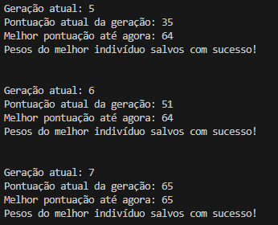
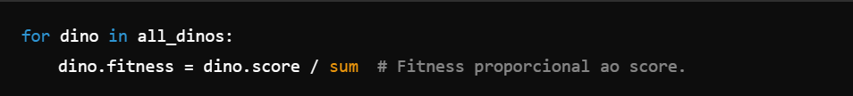
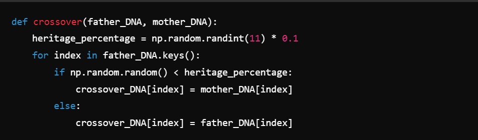
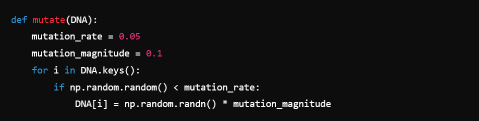
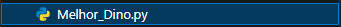

<h1 align="center">
    <a>🦖 Evolução de Dinossauros no Jogo Dino Game Usando Algoritmos Genéticos 🦖 </a>
</h1>


### 🔹 Sobre o projeto
Este projeto utiliza algoritmos genéticos para treinar dinossauros no jogo Dino Game, simulando a evolução de agentes (dinossauros) ao longo de várias gerações para melhorar seu desempenho no jogo.

---

### 🔹 Objetivo
Evoluir agentes dinossauros para maximizar sua performance no jogo Dino Game ao longo das gerações, utilizando os conceitos de **seleção natural**, **mutação genética** e **crossover** conforme ilustrado nas imagens abaixo:


🔸**3ª Geração:**



🔸**7ª Geração:**



🔸**Exibição das informações que acontecem nas partidas:**




---

### 🔹 Requisitos e Instalação
🔸**Requisitos:**
- Python 3
- Bibliotecas necessárias:
    - ``` git clone https://github.com/GrupoTuringCodes/chrome-trex-rush ``` 
    - ``` cd chrome-trex-rush  ``` 
    - ``` pip install chrome-trex-rush/  ```

<br>

🔸**Instalação:**
1. Clone o repositório:
``` github.com/natalia-martins/TrainingTAIC.git ```

---

### 🔹 Estrutura do Projeto

🗂 Abaixo está a estrutura de diretórios e arquivos do projeto, com uma breve descrição de cada componente:

```
.
├── bibliotecas/                             # Contém módulos auxiliares.
├── Dino.py                                  # Implementação da classe Dino e comportamento do agente.
├── Genetic_Algorithm.py                     # Implementação dos algoritmos genéticos (seleção, crossover, mutação).
├── Background.py                            # Gerenciamento do cenário do jogo (nuvens, chão).
├── Brain.py                                 # Implementação da rede neural (cérebro) dos dinossauros.
├── Dino_Game.py                             # Lógica principal do jogo Dino Game.
├── Obstacles.py                             # Implementação dos obstáculos (cactos, pterossauros).
├── chrome-trex-rush/                        # Biblioteca do jogo base clonada do repositório oficial.
│   └── ...
├── imagens/                                 # Contém os arquivos de imagem (sprites) usados no jogo.
├── dino_run_0.png                           # Imagem do dinossauro correndo (frame 1).
├── dino_run_1.png                           # Imagem do dinossauro correndo (frame 2).
├── cactus_0.png                             # Imagem de obstáculo (cacto 1).
├── cactus_1.png                             # Imagem de obstáculo (cacto 2).
├── cactus_2.png                             # Imagem de obstáculo (cacto 3).
├── cactus_3.png                             # Imagem de obstáculo (cacto 4).
├── cactus_4.png                             # Imagem de obstáculo (cacto 5).
├── cactus_5.png                             # Imagem de obstáculo (cacto 6).
├── cactus_6.png                             # Imagem de obstáculo (cacto 7).
├── cactus_7.png                             # Imagem de obstáculo (cacto 8).
├── cactus_8.png                             # Imagem de obstáculo (cacto 9).
├── cactus_9.png                             # Imagem de obstáculo (cacto 10).
├── cactus_10.png                            # Imagem de obstáculo (cacto 11).
├── cactus_11.png                            # Imagem de obstáculo (cacto 12).
├── cactus_12.png                            # Imagem de obstáculo (cacto 13).
├── cactus_13.png                            # Imagem de obstáculo (cacto 14).
├── cactus_14.png                            # Imagem de obstáculo (cacto 15).
├── cactus_15.png                            # Imagem de obstáculo (cacto 16).
├── cloud.png                                # Imagem de nuvem para o cenário.
├── dino_duck_0.png                          # Imagem do dinossauro abaixado (frame 1).
├── dino_duck_1.png                          # Imagem do dinossauro abaixado (frame 2).
├── ground.png                               # Imagem do chão do jogo.
├── offline-sprite-2x.png                    # Imagem usada como referência visual no modo offline.
├── ptera_0.png                              # Imagem de obstáculo (pterossauro, frame 1).
├── ptera_1.png                              # Imagem de obstáculo (pterossauro, frame 2).
├── Algoritmo_Evolutivo_DinoGame.py          # Algoritmo principal para treinar o dinossauro.
├── Melhor_Dino.py                           # Executa o melhor dinossauro com os pesos salvos.
├── README.md                                # Arquivo de documentação do projeto.
├── Teste.py                                 # Script de teste para verificar o funcionamento.
├── pesos_melhor_individuo.json              # Arquivo JSON contendo os pesos do melhor dinossauro.
```


---

### 🔹 Algoritmos Genéticos Utilizados
No projeto, foram utilizados diversos algoritmos genéticos para evoluir os dinossauros ao longo das gerações. 

Os principais são:

### **1. Seleção Proporcional ao Fitness**

🔸 **Como funciona:** 

Utilizamos um algoritmo de seleção proporcional ao fitness. Dinossauros com maior pontuação têm mais chances de serem selecionados para reprodução. A pontuação de cada dinossauro é elevada ao quadrado para enfatizar a diferença entre os mais aptos e os menos aptos.

🔸 **Código:**


🔸 **Diferencial:** 

Testamos outros métodos de seleção, mas a seleção proporcional proporcionou uma maior diversidade inicial, garantindo que dinossauros com pequenas vantagens evoluíssem mais rápido.

<br>

### **2. Crossover Genético**

🔸 **Como funciona:** 

Durante o crossover, genes de dois pais são combinados para gerar um novo indivíduo (filho). A chance de herdar genes de um dos pais é controlada por uma porcentagem de herança, sorteada aleatoriamente.

🔸 **Código:**


🔸 **Diferencial:** 

O uso de um crossover com variação aleatória na herança (entre 0% a 100%) garantiu que os indivíduos tivessem uma mistura equilibrada de genes.

<br>

### **3. Mutação**

🔸 **Como funciona:** 

Após o crossover, cada gene pode sofrer mutação com uma taxa de mutação de 5%. A mutação altera aleatoriamente os pesos da rede neural, adicionando variação ao pool genético.

🔸 **Código:**



🔸 **Diferencial:** 

Testamos diferentes taxas de mutação. Concluímos que uma taxa de 5% com magnitude de 0.1 trouxe o equilíbrio ideal entre diversidade e estabilidade no treinamento.

--- 

### 🔹 Processos de Treinamento

**1. Início do Treinamento**
   * O treinamento começa com uma população de dinossauros gerada aleatoriamente. Cada dinossauro tenta pular obstáculos, e sua performance determina sua pontuação e fitness.

**2. Momento Avançado do Treinamento**
   * Após várias gerações, os dinossauros começam a mostrar melhorias significativas. Dinossauros com bom desempenho sobrevivem, e sua inteligência evolui, ajustando melhor suas ações.
  
**3. Melhor Indivíduo**
   * O melhor dinossauro é salvo, com seus pesos sendo armazenados em um arquivo. Ele pode ser carregado posteriormente para testes e comparações.
  
--- 
### 🔹 Comportamento do Código
O código segue o ciclo clássico de um algoritmo genético:

  1. **Criação de uma população inicial** de dinossauros.
   
  2. **Avaliação:** Cada dinossauro joga e acumula uma pontuação.
   
  3. **Seleção:** Dinossauros mais aptos são selecionados.
   
  4. **Reprodução:** Realiza-se crossover e mutação para criar novos dinossauros.
   
  5. **Repetição:** O processo é repetido por várias gerações.
   
A cada nova geração, o comportamento do dinossauro melhora à medida que ele se adapta ao ambiente do jogo.

---
### 🔹 Resultados e Curiosidades

1. **Melhor Algoritmo:** O crossover com taxa de herança variável se mostrou mais eficiente do que outros métodos.
   
2. **Curiosidade:** No início, observamos que a mutação alta atrapalhava a convergência do treinamento. Após ajustar a magnitude da mutação, obtivemos uma evolução mais estável.

3. **Resultado com 1500 pontos:** O dinossauro atingiu uma pontuação superior a 1500, resultado de uma combinação eficaz de estratégias evolutivas. A utilização de uma população relativamente grande, com 200 dinossauros por geração, permitiu uma ampla diversidade genética, proporcionando mais oportunidades de encontrar soluções eficazes para superar os desafios do jogo. Além disso, a taxa de mutação aplicada incentivou a exploração de diferentes possibilidades de comportamento, aumentando a capacidade de adaptação dos dinossauros. Por fim, o processo de reprodução, baseado na seleção dos dinossauros de maior desempenho a cada geração, garantiu que as características mais adequadas fossem transmitidas, acelerando a evolução ao longo das gerações e resultando em uma pontuação elevada.


4. **Resultado com mais de 10000 pontos::** O dinossauro conseguiu superar a pontuação de 10.000 pontos, o que demonstra a eficácia das técnicas evolutivas aplicadas. O uso de uma população relativamente grande, com 200 dinossauros por geração, permitiu uma diversidade genética significativa, garantindo que diferentes estratégias fossem testadas e aprimoradas ao longo do tempo. Essa diversidade proporcionou uma maior chance de explorar soluções eficientes para enfrentar os obstáculos do jogo.

    Além disso, a taxa de mutação cuidadosamente ajustada foi fundamental para escapar de armadilhas locais, permitindo que o algoritmo evolutivo explorasse novos comportamentos. Essa exploração garantiu que novas variações fossem constantemente       introduzidas no pool genético, aumentando a chance de se encontrar comportamentos que maximizassem a sobrevivência e a pontuação.
    
    O processo de seleção natural, que favoreceu os dinossauros com melhor desempenho, garantiu que as características mais bem-sucedidas fossem transmitidas para as gerações seguintes. Esse ciclo contínuo de seleção, reprodução e mutação, ao          longo de diversas gerações, levou à evolução de dinossauros altamente adaptados, resultando em uma pontuação impressionante de 10.000 pontos.
    
    Esses resultados comprovam que a combinação de uma população diversificada, uma taxa de mutação adequada e uma estratégia de reprodução eficaz foi essencial para alcançar esse alto nível de desempenho no jogo.
   


---

### 🔹 Salvar e Rodar o Melhor Dinossauro

O melhor dinossauro é salvo automaticamente no arquivo "pesos_melhor_individuo.json" após cada geração. 

Para rodar o melhor dinossauro:



Comando:  
-  ```python Melhor_Dino.py ```

---
### 🔹 Vídeos Demonstrativos

🔸 **1. Início do Treinamento:**

https://github.com/user-attachments/assets/05211b9b-a70b-4084-9baa-d01865ca3170


🔸 **2. Momento Avançado:**

https://github.com/user-attachments/assets/d713b36f-1b8b-4eed-8890-12751d152bd7


🔸 **3. Melhor Dinossauro:**


--- 
### 🔹 Conclusão e Aprendizados

- Implementamos algoritmos genéticos para evoluir dinossauros no jogo T-Rex Rush.

- Primeiro, optamos por utilizar um algoritmo evolutivo baseado em aprendizado por reforço, devido à sua simplicidade de implementação, mas os resultados obtidos não foram satisfatorios.
  
- A mutação e o crossover foram ajustados para melhorar a convergência e estabilidade.
  
- O uso de uma seleção proporcional ao fitness aumentou a diversidade genética.

--- 

### 🔹 Uso
#### 🔸 Configuração Inicial
Antes de rodar o algoritmo genético, certifique-se de que a biblioteca chrome-trex-rush está corretamente instalada e configurada. Consulte a [documentação oficial](https://github.com/turing-usp/chrome-trex-rush/blob/master/README.md)  para obter detalhes sobre a configuração.

#### 🔸 Executando o Algoritmo Genético
1. Inicie o processo de treinamento executando o seguinte comando:
``` python src/genetic_algorithm.py ```

2. Durante o treinamento, os agentes evoluirão com base em uma função de aptidão, e você poderá observar sua melhoria ao longo das gerações.

#### 🔸 Funções Principais
- ``` DinoAgent ```: Classe que representa um dinossauro no jogo T-Rex. Os genes determinam seu comportamento e a função de aptidão mede seu desempenho.
- ``` genetic_algorithm ```: Função principal que executa o algoritmo genético, realizando as operações de seleção, cruzamento e mutação.

#### 🔸 Testes
Para garantir que o código está funcionando corretamente, rode os testes unitários:
``` pytest ```

#### 🔸 Contribuição
Contribuições são bem-vindas! Siga os passos abaixo para contribuir:
1. Faça um fork do repositório.
2. Crie uma branch para sua feature ou correção.
3. Implemente suas mudanças e adicione testes (se necessário).
4. Envie um pull request com uma descrição clara das modificações.

---

### 🔹 Links Importantes:
- [Biblioteca chrome-trex-rush](https://github.com/turing-usp/chrome-trex-rush/blob/master/README.md)
- [Template de Repositório](https://github.com/ArielMAJ/python-repository-template)

---

### 🔹 Contato
Para dúvidas ou sugestões, entre em contato com:
- 👩‍💻 natalia.santos@aln.senaicimetec.edu.br
- 👩🏽‍💻 nathalia.leite@ba.estudante.senai.br
- 👩‍💻 rafael.matos@aln.senaicimatec.edu.br
<h1 align="center">
